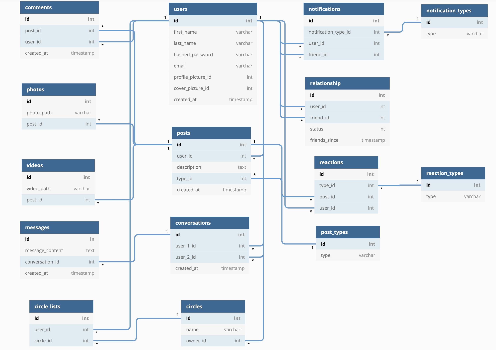

# deary

Deary is a social media website modeled after Facebook. Its objective is to help you stay in touch with the people you actually care about. Deary makes it easy to let your close friends and family know about your life events, minor or major. Users can explore the app both in a browser or through the mobile app.
# User Stories
* As a typical user, I want to post about my live events, so that my friends and family are aware of what's going on in my life.
* As a typical user, I want to learn about my friends' and family's life events, so that I know what's going on in their life
* As a typical user, I want to group my friends into circles, so that I can filter out who see certain life events and who doesn't
* As a typical user, I want to text/phone/video chat with friends and family, so that it is easier to stay in touch.

# Minimum Viable Product

## 1. User Authentication, Login, Logout, Signup
* Users can log in, log out, and sign up.
* Users can use the guest/demo login to try the website.
* Users have to be signed in to use this site.

## 2. Main browsing page
* Users can view the different types of life events from their close people, (infinite scroll)
* Users can react to those life events with emojis
* Users can comment on those life events
* Users can view posts by circles
* Users can create new circles

## 3. Navigation
* Users can post about their life event from the different posting options available
* Users can navigate between different created circles of their close people
* Users can navigate to their profile
* Users can view notifications
* Users can navigate to chat

## 4. Create a Post
* Users can select from the different kinds of life events, or just post without a life event
* Users can upload photos/videos with any kind of events
* Users can tag any person they want
* Users can set location with the tag
* Users can set their mood
* Users can specify which circle they want to view their post

## 5. Edit/Delete a Post
* Users can edit/delete their published posts

## 6. Profile
* Users can view/edit their personal information section
* Users can view their published posts
* Users can change their profile picture
* Users can add a cover picture
* Users can see their friends list
* Users can view/edit their circles

## 7. Search 
* Users can search for people both in their friends list or strangers
* Users can choose to add friends

## 8. Circles
* Users can create circles
* Users can add friends to each circle

## 9. Chat
* Users can text message any individual they have connected with
* Users can create a group chat
* Users can voice/video chat

# Database Schema

